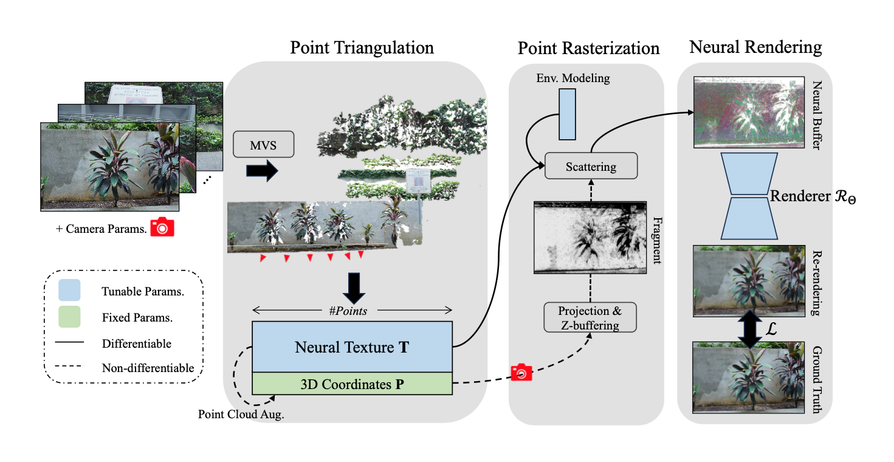

# RPBG: Robust Point-based Graphics

[RPBG: Towards Robust Neural Point-based Graphics in the Wild](https://arxiv.org/abs/2405.05663)<br />
[Qingtian Zhu](https://qtzhu.me)<sup>1</sup>, [Zizhuang Wei](https://scholar.google.com/citations?user=3Vd4LlYAAAAJ&hl)<sup>2,3</sup>, [Zhongtian Zheng](https://zzttzz.github.io/)<sup>3</sup>, [Yifan Zhan](https://github.com/Yifever20002)<sup>1</sup>, Zhuyu Yao<sup>4</sup>, Jiawang Zhang<sup>4</sup>, [Kejian Wu](https://scholar.google.com/citations?user=FXdoGrIAAAAJ)<sup>4</sup>, [Yinqiang Zheng](https://www.ai.u-tokyo.ac.jp/ja/members/yqzheng)<sup>1</sup><br />
<sup>1</sup>The University of Tokyo, <sup>2</sup>Huawei Technologies, <sup>3</sup>Peking University, <sup>4</sup>XREAL<br />
Under Review.

<p align="center">

</p>

## Environment

The configuration of running environment involves CUDA compiling, so please make sure NVCC has been installed (``nvcc -V`` to check the version) and the installed PyTorch is compiled with the same CUDA version.

For example, if the system's CUDA is 11.8, run the following commands to configure the environment:

```shell
conda create -n RPBG python=3.9 -y && conda activate RPBG
pip install torch torchvision --index-url https://download.pytorch.org/whl/cu118
pip install -r requirements.txt
pip install ./pcpr
```

## Custom Data

We provide the scripts to process custom data without camera calibration and triangulation. The typical data structure is as follows.
```
|-- custom_root_path
    |-- camera.xml # agisoft format of camera intrinsics & extrinsics
    |-- scene-sparse.yaml # configuration file for sparse triangulation (SfM)
    |-- scene-dense.yaml # configuration file for dense triangulation (MVS)
    |-- images # raw images (considered distorted thus not to be used in training)
    |-- sfm
        |-- sparse_pcd.ply # sparsely triangulated points
        |-- undis 
            |-- images # undistorted images (undistorted, to be used in training)
    |-- mvs
        |-- dense_pcd.ply # densely triangulated points
```

### Data Preparation
First configure the path of your data & COLMAP installation in the script in `triangulation/prepare_inputs.sh`, as well as other settings if wanted, e.g., GPU indexes and distortion models, and execute it. Note that the GPU-enabled SIFT of COLMAP does not work under headless servers.

```
sh triangulation/prepare_inputs.sh
```
Then please fill the relevant information in `configs/paths.yaml` and create a custom config file similar to `configs/custom/sample.yaml`, and adopting the default set of hyper-parameters will just work fine.

Following [NPBG](https://github.com/alievk/npbg) and [READ](https://github.com/JOP-Lee/READ), we follow the data convention of Agisoft Metashape, but we provide a useful [script](https://github.com/QT-Zhu/RPBG/blob/main/tools/pose_format_converter.py) for converting camera parameters from one to another. It's now supporting:

- Agisoft Metashape
- Open3D-style camera trajectory
- COLMAP sparse reconstruction
- MVSNet-style format


### Training
To start training, please follow the scripts in `scripts`.
We give an example as follows.
```
sh scripts/train.sh configs/custom/sample.yaml
```

## Citation
```
@article{zhu2024rpbg,
  title={RPBG: Towards Robust Neural Point-based Graphics in the Wild},
  author={Zhu, Qingtian and Wei, Zizhuang and Zheng, Zhongtian and Zhan, Yifan and Yao, Zhuyu and Zhang, Jiawang and Wu, Kejian and Zheng, Yinqiang},
  journal={arXiv preprint arXiv:2405.05663},
  year={2024}
}
```

## Acknowledgements
We would like to thank the maintainers of the following repositories.
- [PCPR](https://github.com/wuminye/PCPR): for point cloud rasterization (z-buffering) by pure CUDA
- [NPBG](https://github.com/alievk/npbg): for the general point-based neural rendering pipeline & data convention
- [READ](https://github.com/JOP-Lee/READ): for more features and the MIMO-UNet implemented
- [Open3D](https://github.com/isl-org/Open3D): for visualization of point clouds on headless servers
- [COLMAP](https://colmap.github.io): for camera calibration and sparse triangulation
- [AA-RMVSNet](https://github.com/QT-Zhu/AA-RMVSNet): for dense triangulation
